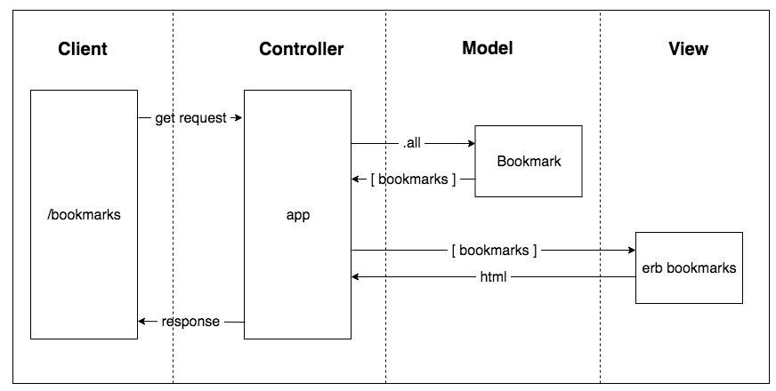

# Bookmark Manager
Week 4 of Makers Academy afternoon challenge: building a bookmark manager.



### To set up the database:

1. Connect to psql
2. Create the bookmark_manager database: `CREATE DATABASE bookmark_manager;`
3. To set up the appropriate tables, connect to the database in `psql` and run the SQL scripts in the `db/migrations` folder in the given order.

### To run the Bookmark Manager app:

Run `rackup -p 3000`

To view bookmarks, navigate to `localhost:3000/bookmarks`.

### User story 1
```
As a user,
So I can see my saved bookmarks,
I'd like to be able to pull up a list of saved bookmarks
```
### User story 2
```
As a user,
So I can save a website,
I'd like to add the website's address to my bookmark manager
```
### User story 3
```
As a user,
So I can remove websites I don't like,
I'd like to be able to delete websites from my bookmark manager
```
